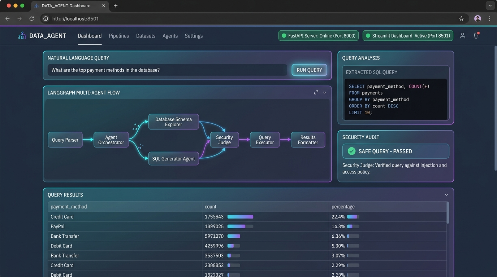
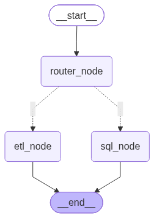
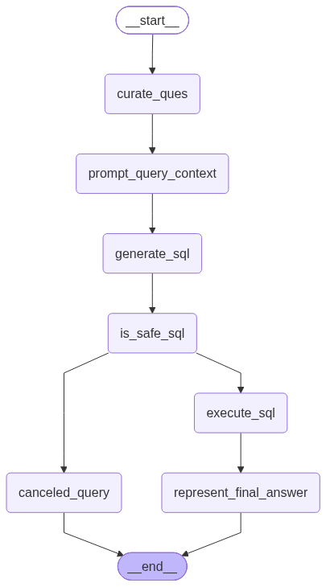

# 🤖 DATA_AGENT: Multi-Agent Orchestrated Autonomous Data Platform

[](https://www.python.org/)
[](https://github.com/langchain-ai/langgraph)
[](https://github.com/langchain-ai/langchain)
[](https://fastapi.tiangolo.com/)
[](https://streamlit.io/)
[](LICENSE)

An autonomous, multi-agent AI system for database reporting (**Text-to-SQL with Zero-Trust Security Guardrails**) and automated **ETL Data Pipelines**. Built with **LangGraph**, **LangChain**, **PostgreSQL**, **FastAPI**, **Streamlit**, and **Pandas**.

DATA_AGENT interprets natural language requests, dynamically classifies intent via a **Master Router**, and delegates execution to specialized sub-agent graphs with strict security and validation controls.

---

## 📸 Dashboard & UI Preview



*Interactive Streamlit dashboard displaying live natural language query execution, state graph execution visualization, SQL generation, Security Judge validation, and dynamic query result tables.*

---

## 🌟 Key Capabilities & Features

* **🧠 Hierarchical Master Router:** Uses Pydantic structured output classification (`RouterSchema`) to deterministically route natural language prompts between SQL reporting and ETL extraction workflows.
* **🛡️ Security-Guardrailed Text-to-SQL:**
  * **Dynamic Live Schema Inspection:** Fetches live database table definitions, column data types, and sample rows (`LIMIT 5`) from PostgreSQL.
  * **Security Judge Node:** Evaluates query safety via structured output (`JudgeSchema`) to strictly block destructive operations (`DROP`, `DELETE`, `UPDATE`, `ALTER`, `TRUNCATE`, `CREATE`).
  * **Automatic Result Truncation:** Enforces query limits (`LIMIT 10`) to prevent memory overload or database lockup.
* **⚡ Autonomous ETL Pipeline Engine:**
  * **API Extraction & Loading:** Automatically ingests REST API JSON payloads and normalizes them into structured formats (**CSV**, **JSON**, **Parquet**).
  * **Dynamic Pandas Code Generation:** Previews sample data schemas and synthesizes context-aware Pandas transformation code.
  * **Sandboxed Code Execution:** Executes generated Python code inside an isolated execution environment with full stack trace capture.
* **🖥️ Dual Deployment Interfaces:**
  * **Streamlit Web Dashboard (`http://localhost:8501`)**: Full visual UI for natural language data exploration and multi-agent workflow inspection.
  * **FastAPI REST API (`http://localhost:8000`)**: Swagger interactive API documentation for programmatic integration.

---

## 📐 System Architecture

### Multi-Agent Orchestration Flow

```
                                  +-------------------------+
                                  |   User Natural Input    |
                                  +-------------------------+
                                               |
                                               v
                                  +-------------------------+
                                  |   Master Router Graph   |
                                  |  (data_agent_graph.png) |
                                  +-------------------------+
                                            /     \
                                (ETL Route)/       \(SQL Route)
                                          /         \
                                         v           v
                   +-----------------------+       +-------------------------+
                   |   ETL Analyst Graph   |       |    SQL Analyst Graph    |
                   | (etl_analyst_graph.png)|       |(sql_analyst_graph.png)  |
                   +-----------------------+       +-------------------------+
                   | - REST API Extract    |       | - Question Curation     |
                   | - Dynamic Pandas Gen  |       | - Live Schema Fetch     |
                   | - Sandboxed Exec      |       | - Safe SQL Generation   |
                   +-----------------------+       | - Security Judge Node   |
                                                   | - Postgres Execution    |
                                                   | - Natural Answer Synth  |
                                                   +-------------------------+
```

### Visual Graph Topologies

| Master Router | SQL Analyst Sub-Graph | ETL Analyst Sub-Graph |
| :---: | :---: | :---: |
|  |  |  |

---

## 🛠️ Tech Stack & Ecosystem

* **Multi-Agent Orchestration:** LangGraph, LangChain
* **Schema Validation & Guardrails:** Pydantic `BaseModel`
* **Data Processing & Storage:** Pandas, PostgreSQL (`psycopg2`)
* **API Backend & Web Dashboard:** FastAPI, Uvicorn, Streamlit
* **Python Runtime & Dependency Management:** Python 3.13, `uv`

---

## 🚀 Quick Start Guide

### 1. Prerequisites & Environment Setup

Clone the repository and ensure you have `uv` installed:

```bash
git clone https://github.com/krishna0tak/DATA_AGENT.git
cd DATA_AGENT
```

Create a `.env` file in the project root:

```env
OPENAI_API_KEY=your_openai_api_key_here

# PostgreSQL Database Configuration
host=localhost
port=5432
user=postgres
password=your_database_password
database=postgres
```

### 2. Launch Services (FastAPI + Streamlit Dashboard)

Run both the FastAPI backend server and Streamlit dashboard using the unified launcher:

```bash
uv run python run_all.py
```

* ⚡ **Streamlit Dashboard:** [http://localhost:8501](http://localhost:8501)
* 🚀 **FastAPI Backend & Swagger Docs:** [http://localhost:8000/docs](http://localhost:8000/docs)

To launch individual services:

```bash
# Streamlit dashboard only
uv run python run_all.py --streamlit

# FastAPI server only
uv run python run_all.py --api
```

---

## 📹 Pitch Video Script

Looking for the 5-minute pitch demo walkthrough script and presentation guide? Check out [`PITCH_SCRIPT.md`](PITCH_SCRIPT.md).

---

## 📄 License

Distributed under the MIT License. See `LICENSE` for details.
